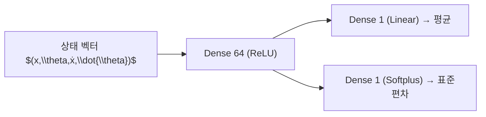

# A Hybrid Approach for Reinforcement Learning Using Virtual Policy Gradient for Balancing an Inverted Pendulum

# 핵심 요약 및 분석

## 주요 주장 및 기여  
이 논문은 **가상 시뮬레이션 기반의 정책 경사(Policy Gradient) 알고리즘**을 활용하여 단일 역진자(inverted pendulum) 제어기를 학습한 뒤, 이를 **실제 물리 시스템으로 전이(transfer)**함으로써 강화학습의 실험·데이터 비용 문제를 해결하고자 한다. 핵심 기여는 다음과 같다.[1]
- 가상 환경에서 학습한 정책을 실제 카트-역진자 시스템에 적용해 **5분 이상 안정적 균형 제어**에 성공.  
- 마찰·감쇠·모터 전기역학 등을 포함한 물리 모델을 기반으로 한 **정확한 시뮬레이션** 구현.  
- **단일 은닉층(64유닛) 신경망**과 Vanilla Policy Gradient를 결합해 간단하면서도 실용적인 제어기를 제안.

## 1. 해결하려는 문제  
전통적인 강화학습은 **실제 시스템에서 수만~수십만 회의 상호작용**을 필요로 하나, 실제 역진자 실험은 시간·비용 제약이 커 데이터 수집이 어렵다. 따라서 가상 시뮬레이션으로 학습을 완료한 후 실제로 배포하는 방식을 통해 **데이터 효율성·훈련 속도·안정성** 문제를 해결하고자 한다.[1]

## 2. 제안 방법  
### 2.1 물리 모델 및 시뮬레이션  
- 상태 공간: 위치 $$x$$, 각도 $$\theta$$, 선형 속도 $$\dot x$$, 각속도 $$\dot\theta$$.  
- 동역학 방정식(예: 수식 5):  

$$
    \begin{aligned}
    \ddot x &= \frac{3r^2 m_p B_p \cos\theta - pD\,4M_pr^2 m_p \sin\theta\,\dot\theta^2 - D\,4R_mr^2 m_p B_{eq}K_tK_m x}{4M_pr^2 m_p + M_pr^2 m_pJ_mK_g^2 + \ldots},\\
    \ddot\theta &= \cdots
    \end{aligned}
  $$

[1]
- **반-암시적 오일러 (semi-implicit Euler)** 적분(수식 6)으로 에너지 보존과 장시간 안정성 확보.

### 2.2 정책 및 보상  
- **정책 네트워크**: 입력 4 → 은닉 64(ReLU) → 출력 2(mean, std; softplus) 구조.[1]
- 행동 공간: 전압 $$[-10,10]$$ V.  
- 보상 함수(수식 7–8): 각 시점 균형 유지 시 +1, 할인율 $$\gamma$$ 적용한 누적보상 사용.  

### 2.3 학습 알고리즘  
- **Vanilla Policy Gradient**: 손실 $$L = -R\,\log \pi(a|s) + \beta H$$로 정의(수식 9), 엔트로피 항 $$H$$로 탐색 유지[1].  
- 옵티마이저: Adam($$\alpha=0.01$$).  
- **학습 종료 조건**: 500 스텝(10초) 무충돌.

## 3. 모델 구조  

## 4. 실험 결과 및 성능  
- **가상→실제 전이** 후 카트-역진자 시스템에서 5분 이상 균형 유지(가볍게 탭해도 복귀).[1]
- 10초 균형 성공률 91%, 평균 807 trials 소요, 최저 54 trials.[1]
- 비마찰 모델로도 실제 적용 가능성을 보이며, 질량·길이 변경 시에도 짧게나마 균형 유지.

## 5. 한계 및 일반화 성능  
- **초기화 민감도**로 훈련 trial 수 분산 큼(최대 10배 차이).  
- 단일 은닉층 구조·Vanilla PG 한계로 **모델 용량·학습 안정성** 제약.  
- 시뮬레이션 정확도(마찰·동역학 추정) 의존도가 높아, **도메인 변화**에 대해 일반화 성능 불확실.

## 6. 일반화 성능 향상 가능성  
- **도메인 랜덤화(domain randomization)** 적용 시 다양한 물리 파라미터 분포로 학습해 실제 다양성 극복 가능.  
- **고급 RL 기법** (GAE, TRPO, DDPG, NFQ, PILCO 등) 도입으로 데이터 효율성 및 안정성 강화.  
- **모델 기반 RL** 병합으로 불확실성 고려 및 샘플 효율성 개선.

## 7. 향후 연구 방향 및 고려점  
- 파라미터 랜덤화와 **도메인 적응** 기법을 통해 다양한 실제 환경·노이즈 견고성 평가.  
- **다중 역진자(double inverted pendulum)** 등 더 복잡한 시스템으로 확장 실험.  
- **PILCO** 등 모델 기반 접근법으로 데이터 효율성·안정성 극대화.  
- 최신 **Proximal Policy Optimization** 및 **Auto Domain Randomization** 등 기법 적용으로 성능·일반화 동시 개선.

[1](https://ppl-ai-file-upload.s3.amazonaws.com/web/direct-files/attachments/65988149/1ddf575b-d050-4040-a83b-81c812ebc359/A-Hybrid-Approach-for-Reinforcement-Learning-Using-Virtual-Policy-Gradient-for-Balancing-an-Inverted-Pendulum.pdf)
